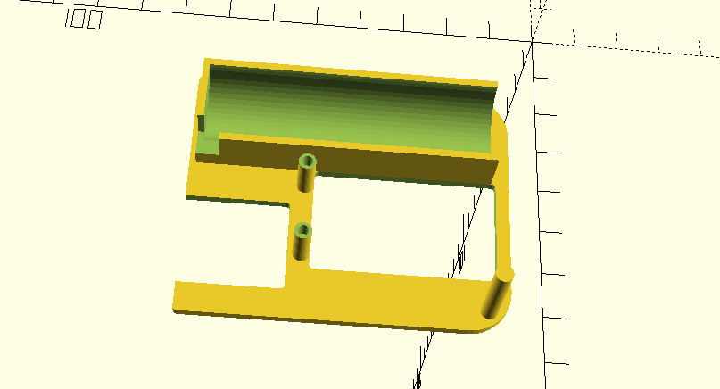
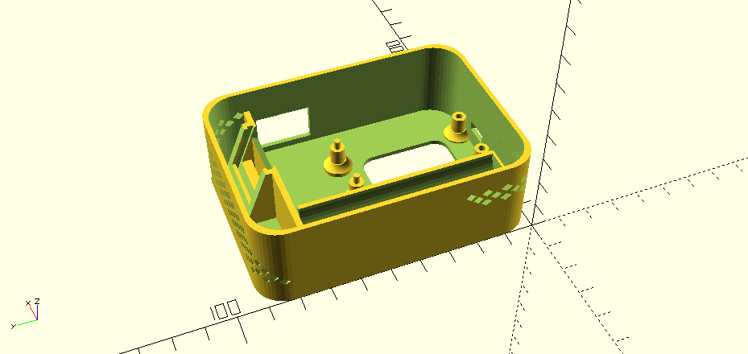
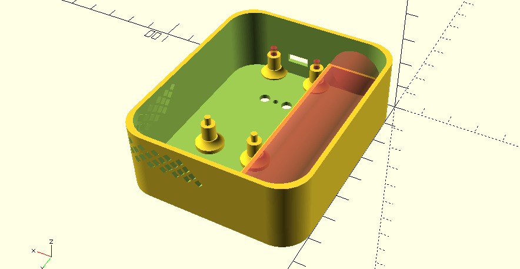
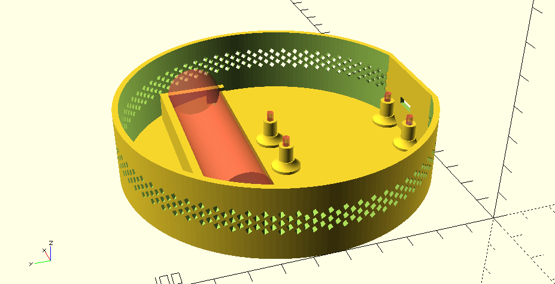
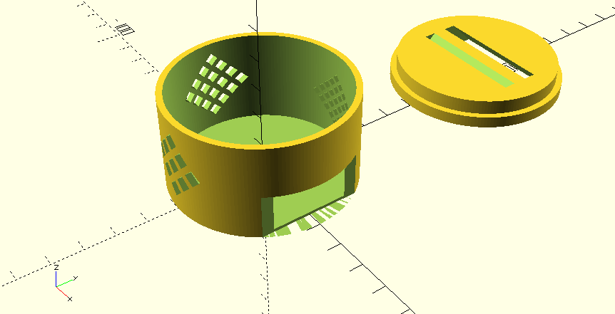

# Feather Project Enclosure

**This project is a work in progress.**

Enclosure built for use with the [Particle mesh](https://www.particle.io/mesh/) product line. This line of micro controllers is built with the [feather specification](https://learn.adafruit.com/adafruit-feather/feather-specification).

## Parts

- [Particle mesh](https://www.particle.io/mesh/) product
- [Lithium Ion Cylindrical Battery](https://www.adafruit.com/product/1781)
- Temperature Sensor TBD

## Features

- Air vents for airflow
- Battery backup support
- Ability to press reset buttons without opening the enclosure
- Screw mounts

## Interior Support

### v0.1

Added interior support to keep battery and Photon core in place.

## Enclosure

### v0.4

Added a slot for a small sensor to fit into. Expanded the size to accomodate the space for the sensor and power switch.

**Settings**

Same as v0.1

### v0.3

Switching the design to a rectangle with rounded corners is a much better utilization of the space. The next step will be designing a place for the sensors to be mounted. The sensors will need some distance from the micro controller to avoid throwing off the temperature values.

**Settings**

Same as v0.1

**Time to print**

- Print time base: 2 hours 18 minutes

### v0.2

After adding the battery holder and feather board mounts, it's clear the circular enclosure is going to be too big. The next version will be a rounded rectangle to maximize space. Both the battery holder and screw mounts were the correct size but the micro usb opening was in the wrong position. This will be corrected in the next version.

**Settings**

Same as v0.1

**Time to print**

I stopped the print half way through so the total time is unknown.

### v0.1

This was a proof of concept to test venting and wall thickness. It turned out well but was too small (as expected). All vents looked good and printed without support. The lid fit snuggly around the base.

**Settings**

- Wall thickness: 1.2mm
- Layer height: 0.2mm
- Printing temperature: 215 C
- Print speed: 60 mm / s
- Brim speed: 10 mm / s
- Top / bottom speed: 20 mm / s
- Inland PLA+ - Black

**Time to print**

- Print time base: 2 hours 19 minutes
- Print time lid: 1 hour 48 minutes
